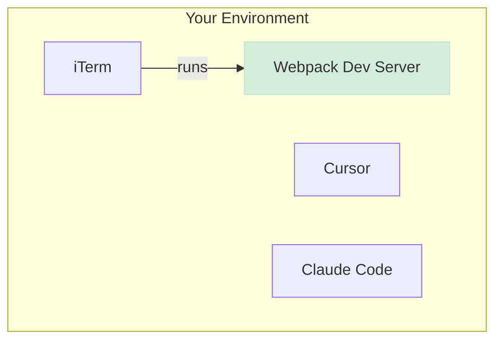
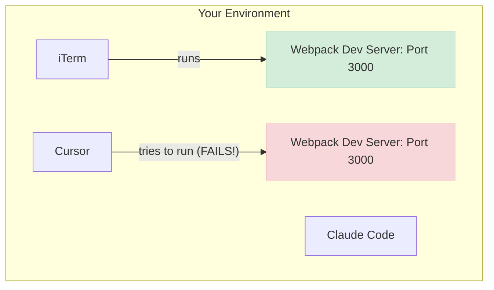
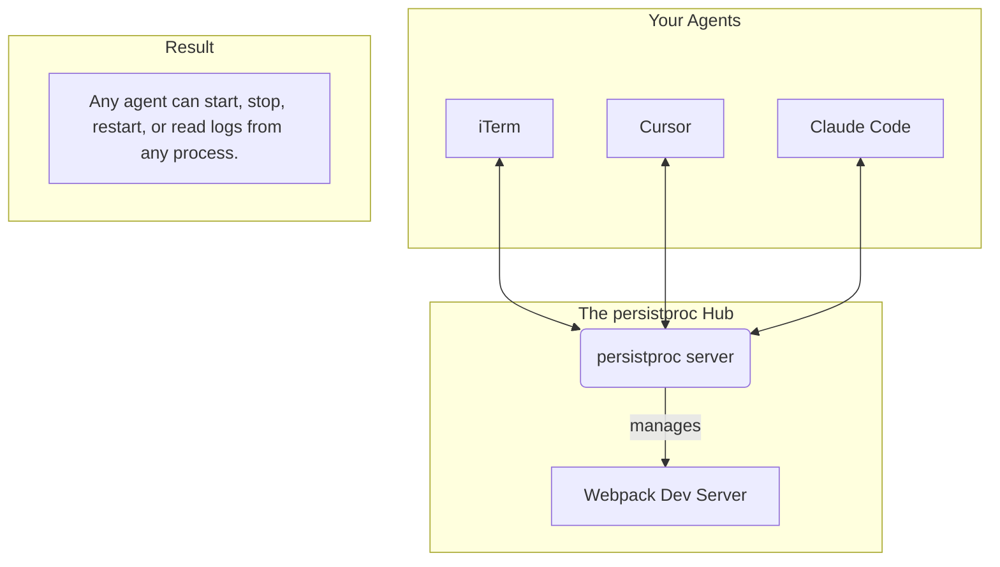

# persistproc
> A shared process layer for the modern, multi-agent development workflow.

---

### The Problem: Competing Agents, Siloed Processes

In the current era of rapid AI development, it's common to switch between multiple tools and AI agents. This often leads to a frustrating and common scenario:

You start your app's frontend `webpack` dev server in iTerm. It's running perfectly.



Then, you move to **Cursor** to make a change to your `webpack.config.js`. The LLM assistant, trying to be helpful, attempts to start the server on its own—but it fails, because you're already running it. The port is already in use.



Next, you switch to **Claude Code** to do some other work that eventually requires a server restart. But Claude has no way of restarting the process running in iTerm, so it asks you to do it manually, wasting your time and breaking your flow.

Your development processes are trapped in the environment they were started in. Each agent is blind to the others, leading to conflicts and manual intervention.

### The Solution: A Shared Process Hub

`persistproc` solves this by decoupling your processes from your terminal sessions. It runs a single, lightweight server in the background that acts as a central hub for all your development processes.



With `persistproc`, your dev server is no longer a siloed process but a shared resource for your entire development environment.

- **Start a process** from iTerm (or have an agent do it).
- **Restart it** from Cursor.
- **Check its logs** from Claude Code.
- No more port conflicts. No more manual restarts. No more copy/pasting output.

## Primary Workflow: Agent-Driven Control

### 1. Start the `persistproc` Server
This is the core daemon that will manage everything. You only need to do this once. Run it in a dedicated terminal window and keep it running. This makes it easy to see server-level activity at a glance.

```bash
persistproc --serve
```
The server will now be running, ready to accept commands from any agent.

### 2. Configure Your AI Agents
For your AI agents (in Cursor, Claude Code, etc.) to use `persistproc`, they need to know where its MCP server is.

#### Cursor / VS Code
In your editor's `settings.json` file, add the following to the `mcp.servers` configuration:
```json
{
  "mcp.servers": {
    "persistproc": {
      "url": "http://127.0.0.1:8947/mcp/"
    }
  }
}
```

#### Claude Code
To add `persistproc` as an MCP server for Claude Code, you first need to have the `persistproc` server running separately:
```bash
persistproc --serve
```
Then, in another terminal, run the following command to tell Claude where to find the running server:

```bash
claude mcp add --transport http persistproc http://127.0.0.1:8947/mcp/
```
Now, agents in Cursor and Claude Code can see and interact with `persistproc`.

### 3. Let Your Agents Start Processes
This is the primary way to start processes. Instead of running commands yourself, you ask your agent to do it.

For example, you can ask your assistant in Cursor:
> "start the webpack dev server"

The agent, now aware of `persistproc`, won't just run a blind shell command. It will see the `start_process` tool and use it correctly: `start_process(command="npm run dev")`.

`persistproc` will start the server, manage it, and report its status and `pid` back to the agent. The process is now available to *all* your agents.

### 4. Manage Processes from Anywhere
Now, the real power emerges. You can switch to a different agent or tool and manage the process you just started.

For example, you can later ask an agent in Claude Code:
> "restart the webpack server"

The agent will see the running processes via `list_processes()` and can call `restart_process(pid=...)` to perform the action. No more port conflicts. No more manual restarts.

## Direct Terminal Usage (Optional)
While the main power comes from agent integration, you can also use the `persistproc` command as a simple client from your own terminal.

### Starting and Tailing
This is useful for starting a process and immediately tailing its logs in one go:

```bash
# In iTerm, for example:
persistproc npm run dev
```
- If `npm run dev` is not running, `persistproc` will start it.
- If `npm run dev` is *already* running, `persistproc` will simply start tailing the logs of the existing process and notify you.

To force a restart of an already-running process, use the `--restart` flag:
```bash
persistproc --restart npm run dev
```

### Stopping a Tailed Process
When you are tailing a process, pressing `Ctrl+C` will stop the log stream and present you with a prompt:

```
--- Log tailing interrupted. ---
Do you want to stop the running process 'npm run dev' (PID 12345)? [y/N]
```

- Pressing `y` will send a termination signal to the process, shutting it down.
- Pressing `n` (or any other key) will only detach the log tail, leaving the process **running** in the background, where it can still be managed by other agents.

## Advanced Management

`persistproc` exposes a standard [Model Context Protocol (MCP)](https://modelcontext.com/) server on `http://127.0.0.1:8947`. You can use any MCP-compatible client to interact with it programmatically for more advanced tasks.

The server exposes the following tools:
- `list_processes()`
- `get_process_status(pid: int)`
- `stop_process(pid: int, force: bool = False)`
- `restart_process(pid: int)`
- `get_process_output(...)`
- `get_process_log_paths(pid: int)`

## Development

Use `./run-dev.sh` to install dependencies in a virtualenv and run `persistproc`.

## License

This project is licensed under the MIT License. 