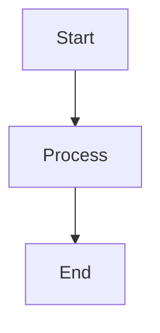

# PersistProc Documentation

This directory contains the complete documentation for PersistProc, built with [Material for MkDocs](https://squidfunk.github.io/mkdocs-material/).

## Building the Documentation

### Prerequisites

- Python 3.10+
- pip

### Setup

1. **Install documentation dependencies**:
   ```bash
   pip install -r requirements-docs.txt
   ```

2. **Serve the documentation locally**:
   ```bash
   mkdocs serve
   ```

3. **Open in browser**:
   Navigate to `http://127.0.0.1:8000`

### Building Static Site

```bash
# Build static site
mkdocs build

# Output will be in site/ directory
```

## Documentation Structure

```
docs/
├── index.md                 # Homepage
├── getting-started/
│   ├── quick-start.md       # 5-minute setup guide
│   ├── installation.md     # Detailed installation
│   └── configuration.md    # Configuration options
├── user-guide/
│   ├── core-concepts.md    # How PersistProc works
│   ├── agent-integration.md # AI agent setup
│   ├── process-management.md # Advanced process control
│   ├── workflows.md        # Common usage patterns
│   └── troubleshooting.md  # Problem solving
├── api/
│   ├── mcp-tools.md        # MCP tool reference
│   ├── cli.md              # Command line reference
│   └── python-api.md       # Python API docs
├── development/
│   ├── contributing.md     # How to contribute
│   ├── setup.md           # Development setup
│   └── architecture.md    # Technical details
└── examples/
    ├── web-development.md  # Web dev workflows
    ├── multi-service.md   # Microservices
    └── custom-workflows.md # Advanced patterns
```

## Contributing to Documentation

### Adding New Pages

1. **Create the markdown file** in the appropriate directory
2. **Add to navigation** in `mkdocs.yml`:
   ```yaml
   nav:
     - User Guide:
       - Your New Page: user-guide/new-page.md
   ```

### Writing Guidelines

#### Code Examples

Use appropriate language tags:

```bash
# Shell commands
persistproc --serve
```

```python
# Python code
import persistproc
```

```json
# JSON configuration
{
  "mcp.servers": {
    "persistproc": {
      "url": "http://127.0.0.1:8947/mcp/"
    }
  }
}
```

#### Admonitions

Use admonitions for important information:

```markdown
!!! warning "Important"
    This is a warning admonition.

!!! tip "Pro Tip"
    This is a tip admonition.

!!! info "Note"
    This is an info admonition.
```

#### Mermaid Diagrams

Include diagrams using Mermaid:

```markdown

```

#### Tabbed Content

Use tabs for multiple options:

```markdown
=== "Option 1"
    Content for option 1

=== "Option 2"
    Content for option 2
```

### Testing Documentation

1. **Check links**:
   ```bash
   # Install markdown-link-check
   npm install -g markdown-link-check
   
   # Check all markdown files
   find docs -name "*.md" -exec markdown-link-check {} \;
   ```

2. **Validate MkDocs config**:
   ```bash
   mkdocs build --strict
   ```

3. **Spell check** (optional):
   ```bash
   # Install cspell
   npm install -g cspell
   
   # Check spelling
   cspell "docs/**/*.md"
   ```

## Deployment

The documentation is automatically deployed when changes are pushed to the main branch.

### Manual Deployment

If you need to deploy manually:

```bash
# Build and deploy to GitHub Pages
mkdocs gh-deploy
```

## Maintenance

### Updating Dependencies

```bash
# Update MkDocs and plugins
pip install --upgrade -r requirements-docs.txt

# Check for outdated packages
pip list --outdated
```

### Link Checking

Regularly check for broken links:

```bash
# Check external links
mkdocs build
python -m http.server 8000 --directory site &
SERVER_PID=$!

# Use a link checker tool
# Kill server
kill $SERVER_PID
```

## Themes and Styling

The documentation uses Material for MkDocs with custom styling:

- **Primary color**: Blue
- **Accent color**: Blue  
- **Font**: Roboto
- **Code font**: Roboto Mono

### Customizing

To modify the theme:

1. **Edit `mkdocs.yml`** for theme configuration
2. **Add custom CSS** in `docs/stylesheets/` (if needed)
3. **Override templates** in `docs/overrides/` (if needed)

## Getting Help

### Documentation Issues

- [File an issue](https://github.com/irskep/persistproc-mcp/issues) for documentation bugs
- [Start a discussion](https://github.com/irskep/persistproc-mcp/discussions) for suggestions

### MkDocs Help

- [MkDocs Documentation](https://www.mkdocs.org/)
- [Material for MkDocs](https://squidfunk.github.io/mkdocs-material/)
- [Markdown Guide](https://www.markdownguide.org/)

---

**Happy documenting!** 📚