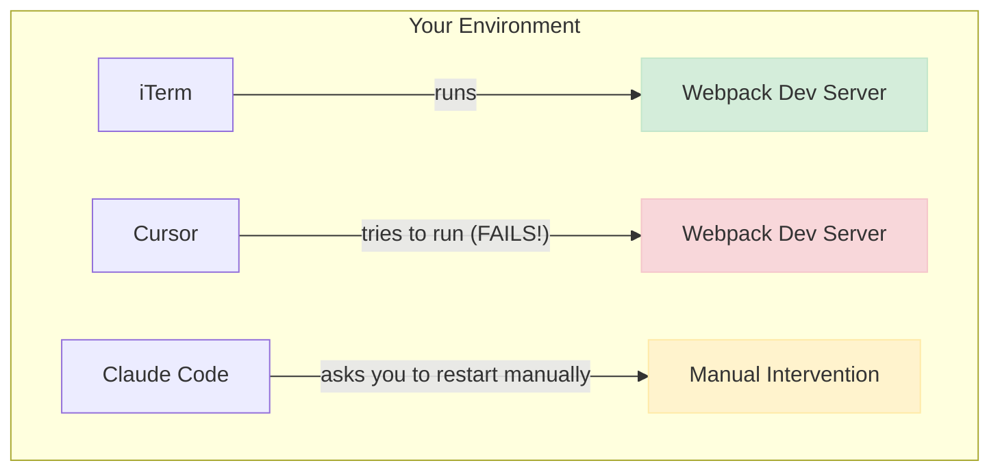
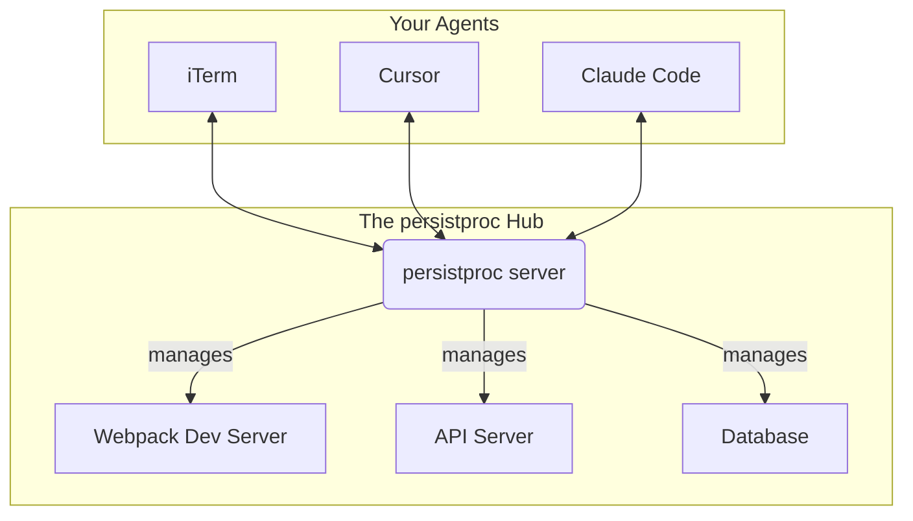

# persistproc

## A shared process layer for the modern, multi-agent development workflow

[](https://badge.fury.io/py/persistproc)
[](https://www.python.org/downloads/)
[](https://opensource.org/licenses/MIT)

---

## The Problem We Solve

When using multiple AI agents and development tools simultaneously, a common problem emerges: **process isolation**.

### Without persistproc



**Problems:**
- Port conflicts when agents try to start the same service
- Manual restarts breaking development flow
- No visibility into running processes across tools

### With persistproc



**Benefits:**
- ✅ Any agent can start, stop, restart processes
- ✅ No port conflicts
- ✅ Shared process visibility
- ✅ Persistent logs across sessions

## Key Features

### 🤖 **Agent-First Design**
Built specifically for modern AI-assisted development workflows. Works seamlessly with Cursor, Claude Code, and any MCP-compatible tool.

### 🔄 **Process Persistence**
Your development servers survive terminal sessions, tool switches, and environment changes.

### 📊 **Centralized Management**
One hub to rule them all. Start, stop, restart, and monitor all your development processes from anywhere.

### 🔍 **Rich Observability**
Real-time logs, process status, and detailed output capture for all managed processes.

### 🌐 **Universal Access**
Access via CLI, MCP tools, or HTTP API. Your processes are available however you need them.

## Quick Start

Get up and running in 3 steps:

### 1. Install persistproc

```bash
pip install persistproc
```

### 2. Start the Server

```bash
persistproc --serve
```

### 3. Configure Your AI Agent

=== "Cursor/VS Code"

    Add to your `settings.json`:
    ```json
    {
      "mcp.servers": {
        "persistproc": {
          "url": "http://127.0.0.1:8947/mcp/"
        }
      }
    }
    ```

=== "Claude Code"

    ```bash
    claude mcp add --transport http persistproc http://127.0.0.1:8947/mcp/
    ```

AI agents can now manage development processes collaboratively.

## Real-World Workflow Example

Here's how persistproc transforms a typical web development session:

!!! example "Multi-Agent Web Development"

    **Scenario**: Building a React app with multiple agents.

    1. **Start Development** (in iTerm):
       ```bash
       persistproc npm run dev
       ```
       Your React dev server starts and logs stream to your terminal.

    2. **Make Changes** (in Cursor):
       Ask your AI assistant: *"The webpack config needs updating for the new CSS framework"*
       
       The assistant makes changes, then says: *"I'll restart the dev server for you"* and uses the `restart_process` tool.

    3. **Debug Issues** (in Claude Code):
       Ask: *"Check the dev server logs for any errors"*
       
       The assistant uses `get_process_output` to analyze recent logs and provides insights.

    4. **Add New Service** (anywhere):
       *"Start the API server too"* → `start_process(command="npm run api")`

    **Result**: Seamless collaboration between you and your AI agents, with zero manual process management.

## Why persistproc?

### For Developers
- **Eliminate Context Switching**: Stop manually managing processes across different tools
- **Reduce Friction**: Let your AI agents handle the boring stuff
- **Improve Reliability**: No more "works on my machine" process issues

### For AI Agents
- **Better Tool Integration**: Standard MCP interface for process management
- **Shared State**: Consistent view of running processes across all agents
- **Rich Context**: Access to logs, status, and process history

### For Teams
- **Consistent Environments**: Same process management across all team members
- **Better Debugging**: Centralized logs and process monitoring
- **Simplified Onboarding**: One tool to manage all development processes

## What's Next?

- [**Quick Start Guide**](getting-started/quick-start.md) - Get running in 5 minutes
- [**Agent Integration**](user-guide/agent-integration.md) - Set up your favorite AI tools
- [**Web Development Example**](examples/web-development.md) - See it in action
- [**API Reference**](api/mcp-tools.md) - Explore all available tools

---

**Ready to supercharge your multi-agent development workflow?** [Get started now →](getting-started/quick-start.md)