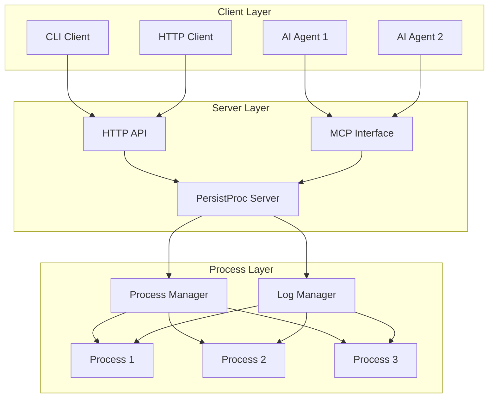
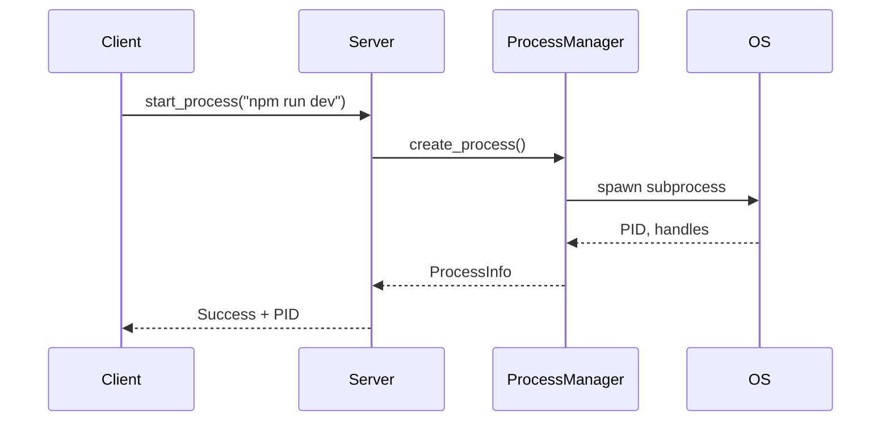
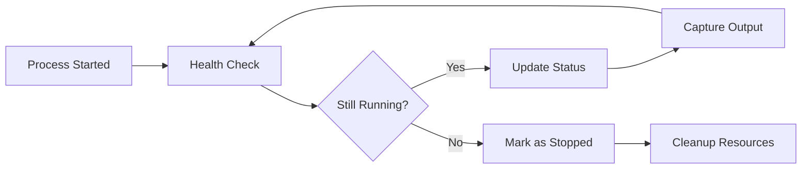
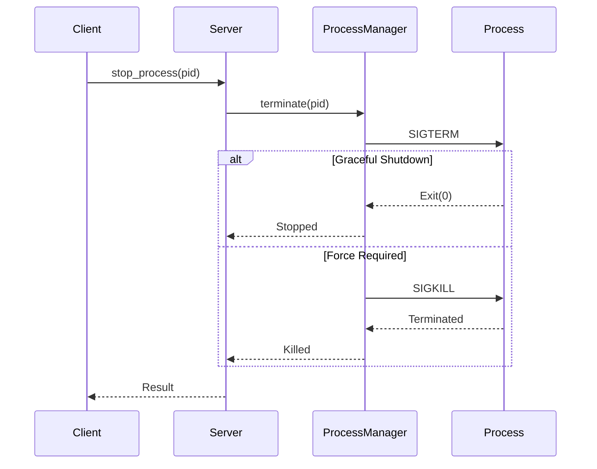
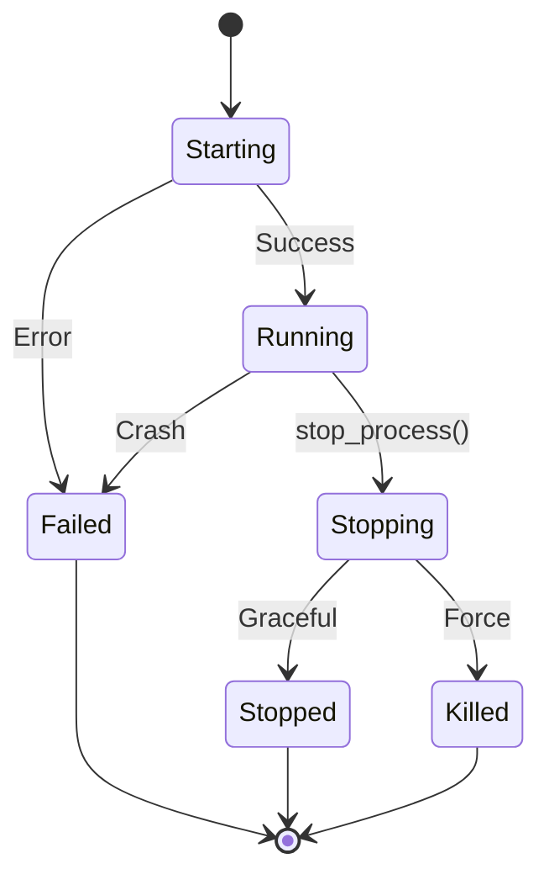

# Core Concepts

Understanding how PersistProc works will help you use it more effectively and troubleshoot issues when they arise.

## Architecture Overview

PersistProc uses a client-server architecture with a central process manager:



## Key Components

### 1. PersistProc Server

The central daemon that manages all processes:

- **Single Source of Truth**: Maintains state for all managed processes
- **Process Lifecycle**: Handles starting, stopping, and monitoring processes
- **Communication Hub**: Provides interfaces for clients and agents
- **Persistence**: Survives across terminal sessions and tool switches

**Key Features:**
- Runs continuously in the background
- Manages process state and metadata
- Captures and stores process output
- Provides real-time status updates

### 2. Process Manager

The core component responsible for process operations:

```python
# Conceptual view of the Process Manager
class ProcessManager:
    def start_process(command, working_dir=None, env=None)
    def stop_process(pid, force=False)
    def restart_process(pid)
    def list_processes()
    def get_process_status(pid)
```

**Responsibilities:**
- Spawn new processes with proper isolation
- Track process PIDs and metadata
- Monitor process health and status
- Handle process termination and cleanup

### 3. Log Manager

Handles all logging and output capture:

- **Real-time Capture**: Streams stdout/stderr from managed processes
- **Persistent Storage**: Saves logs to disk for later retrieval
- **Structured Access**: Provides APIs to query and filter logs
- **Retention Management**: Handles log rotation and cleanup

### 4. MCP Interface

The Model Context Protocol interface for AI agents:

- **Standard Protocol**: Uses the MCP specification for tool definitions
- **Tool-based Interaction**: Exposes process management as callable tools
- **JSON Communication**: All data exchange uses structured JSON
- **Agent Integration**: Works with any MCP-compatible AI agent

## Process Lifecycle

Understanding how processes are managed through their lifecycle:

### 1. Process Creation



**What Happens:**
1. Client requests process start
2. Server validates the command
3. Process Manager spawns the subprocess
4. Output streams are captured
5. Process metadata is stored
6. Status is returned to client

### 2. Process Monitoring



**Continuous Monitoring:**
- Health checks every few seconds
- Output capture and storage
- Resource usage tracking
- Status updates in real-time

### 3. Process Termination



## Data Model

### Process Information

Each managed process has associated metadata:

```json
{
  "pid": 12345,
  "command": "npm run dev",
  "working_directory": "/path/to/project",
  "environment": {"NODE_ENV": "development"},
  "status": "running",
  "start_time": "2024-01-15T10:30:45Z",
  "cpu_percent": 2.5,
  "memory_mb": 128,
  "log_prefix": "12345"
}
```

**Key Fields:**
- **PID**: Operating system process identifier
- **Command**: The original command that started the process
- **Working Directory**: Where the process was started
- **Environment**: Environment variables passed to the process
- **Status**: Current state (running, stopped, failed)
- **Timestamps**: When the process started/stopped
- **Resources**: CPU and memory usage
- **Log Prefix**: Identifier for log files

### Process States

Processes can be in several states:



**State Descriptions:**
- **Starting**: Process is being launched
- **Running**: Process is active and healthy
- **Stopping**: Graceful shutdown in progress
- **Stopped**: Process exited normally
- **Killed**: Process was force-terminated
- **Failed**: Process crashed or failed to start

## Communication Protocols

### MCP Tools

PersistProc exposes these tools to AI agents:

| Tool | Purpose | Parameters |
|------|---------|------------|
| `start_process` | Start a new process | `command`, `working_directory`, `environment` |
| `stop_process` | Stop a running process | `pid`, `force` |
| `restart_process` | Restart a process | `pid` |
| `list_processes` | Get all processes | None |
| `get_process_status` | Get detailed status | `pid` |
| `get_process_output` | Retrieve logs | `pid`, `stream`, `lines`, `before_time`, `since_time` |
| `get_process_log_paths` | Get log file paths | `pid` |

### HTTP API

The server also provides a REST-like HTTP API:

```bash
# Health check
GET /health

# MCP endpoint
POST /mcp/

# Process management
GET /api/processes
POST /api/processes
DELETE /api/processes/{pid}
```

## Security Model

### Process Isolation

- **User Context**: Processes run under the same user as the server
- **Working Directory**: Each process can have its own working directory
- **Environment**: Custom environment variables per process
- **Resource Limits**: Optional CPU/memory constraints

### Network Security

- **Local Only**: Default binding to localhost (127.0.0.1)
- **No Authentication**: Currently relies on network-level security
- **Process Control**: Full access to start/stop any process

!!! warning "Security Considerations"
    PersistProc provides powerful process control. Only run it in trusted environments and consider network restrictions for remote access.

## Performance Characteristics

### Scalability

- **Process Limit**: Can manage dozens of processes simultaneously
- **Memory Usage**: Lightweight server with minimal overhead
- **Log Storage**: Configurable retention and rotation
- **Response Time**: Sub-millisecond tool invocation

### Resource Management

- **CPU Usage**: Minimal server overhead
- **Memory**: Scales with number of managed processes
- **Disk Space**: Grows with log accumulation
- **Network**: Low bandwidth for MCP communication

## Error Handling

### Common Failure Modes

1. **Process Start Failures**
   - Command not found
   - Permission denied
   - Port already in use

2. **Process Crashes**
   - Unexpected termination
   - Out of memory
   - Segmentation faults

3. **Server Issues**
   - Port conflicts
   - Disk space exhaustion
   - Permission problems

### Recovery Mechanisms

- **Automatic Cleanup**: Dead processes are detected and cleaned up
- **State Persistence**: Process state survives server restarts
- **Graceful Degradation**: Partial failures don't affect other processes
- **Error Reporting**: Detailed error messages for debugging

---

**Next**: Learn how to [integrate with AI agents](agent-integration.md) to leverage PersistProc in your workflow.